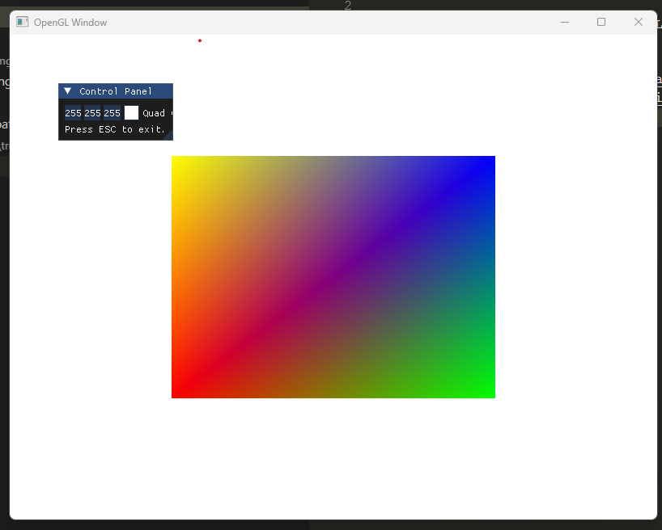

GLFW Window scaffolding.

This project is a template for a GLFW window project.

https://www.glfw.org/
https://github.com/ocornut/imgui?tab=readme-ov-file#getting-started--integration
https://github.com/ocornut/imgui/wiki/Useful-Extensions





```sh
generate.bat
build.bat
run.bat
```


